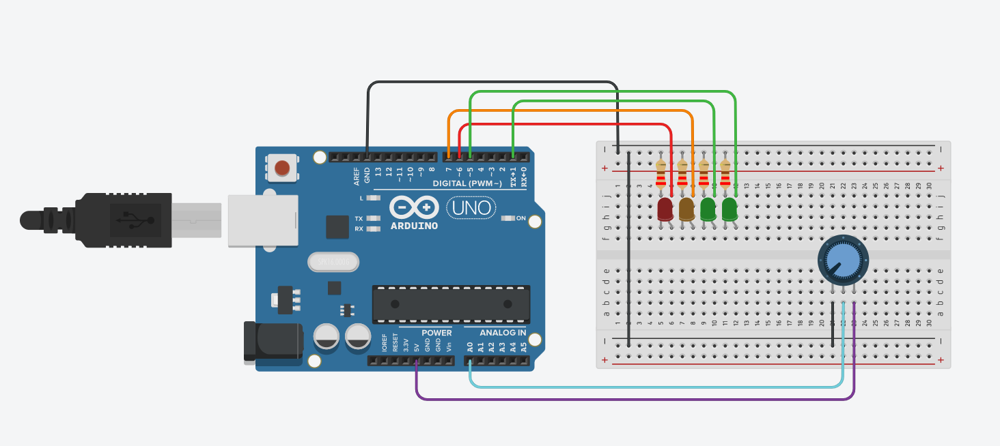

# Arduino simple FuelGauge

This is a simple and DIY FuelGauge for motocycles, cars, rc models or anything else.
The only thing you need is something like a potentiometer or gauge sensor with a floating resistor.

  - cheap
  - accurate
  - easy to build

# Code
I think it´s self explaining:

```C++
short poti = A0;
short value;
short fuelPercentage;
short LED1 = D6; //red LED
short LED2 = D7; //orange LED
short LED3 = D1; //second green LED
short LED4 = D5; //first green LED
int millis1 = 1000;
int millis2 = 500;

const bool SerialDebug = true;

void setup()
{
  Serial.begin(115200);

  pinMode(LED1, OUTPUT);
  pinMode(LED2, OUTPUT);
  pinMode(LED3, OUTPUT);
  pinMode(LED4, OUTPUT);
}

void loop()
{
  value = 0;
  for (int i = 0; i < 10; i++) {
    value += analogRead(poti);
  }
  value = trunc(value / 10);
  fuelPercentage = value;

  fuelPercentage = map(fuelPercentage, 0, 1023, 0, 100); // changes the analogInput range from 0-1023 to 0-100.
  if(SerialDebug)
  {
  Serial.print("Poti = ");
  Serial.println(fuelPercentage); 
  }

  if (fuelPercentage >= 80) // everything is on
  {
    digitalWrite(LED1, HIGH);
    digitalWrite(LED2, HIGH);
    digitalWrite(LED3, HIGH);
    digitalWrite(LED4, HIGH);
  }

  else if (fuelPercentage <= 79 && fuelPercentage >= 70) // green is blinking
  {

    digitalWrite(LED1, HIGH);
    digitalWrite(LED2, HIGH);
    digitalWrite(LED3, HIGH);
    if (millis() % millis1 > millis2)
      digitalWrite(LED4, HIGH);
    else
      digitalWrite(LED4, LOW);
  }

  else if (fuelPercentage <= 69 && fuelPercentage >= 60) // green is off
  {
    digitalWrite(LED1, HIGH);
    digitalWrite(LED2, HIGH);
    digitalWrite(LED3, HIGH);
    digitalWrite(LED4, LOW);
  }

  else if (fuelPercentage <= 59 && fuelPercentage >= 50) // orange is blinking
  {
    digitalWrite(LED1, HIGH);
    digitalWrite(LED2, HIGH);
    if (millis() % millis1 > millis2)
      digitalWrite(LED3, HIGH);
    else
      digitalWrite(LED3, LOW);
    digitalWrite(LED4, LOW);
  }

  else if (fuelPercentage <= 49 && fuelPercentage >= 35) // green and orange is off
  {
    digitalWrite(LED1, HIGH);
    digitalWrite(LED2, HIGH);
    digitalWrite(LED3, LOW);
    digitalWrite(LED4, LOW);
  }

  else if (fuelPercentage <= 34 && fuelPercentage >= 25) // first red is blinking
  {
    digitalWrite(LED1, HIGH);
    if (millis() % millis1 > millis2)
      digitalWrite(LED2, HIGH);
    else
      digitalWrite(LED2, LOW);
    digitalWrite(LED3, LOW);
    digitalWrite(LED4, LOW);
  }

  else if (fuelPercentage <= 25 && fuelPercentage >= 20) // first red LED is off
  {
    digitalWrite(LED1, HIGH);
    digitalWrite(LED2, LOW);
    digitalWrite(LED3, LOW);
    digitalWrite(LED4, LOW);
  }

  else if (fuelPercentage <= 19 && fuelPercentage >= 10) // second red LED is blinking
  {
    if (millis() % millis1 > millis2)
      digitalWrite(LED1, HIGH);
    else
      digitalWrite(LED1, LOW);
    digitalWrite(LED2, LOW);
    digitalWrite(LED3, LOW);
    digitalWrite(LED4, LOW);
  }

  else if (fuelPercentage <= 9) // everything is blinking
  {
    if (millis() % millis1 > millis2)
    {
      digitalWrite(LED1, HIGH);
      digitalWrite(LED2, HIGH);
      digitalWrite(LED3, HIGH);
      digitalWrite(LED4, HIGH);
    }
    else
    {
      digitalWrite(LED1, LOW);
      digitalWrite(LED2, LOW);
      digitalWrite(LED3, LOW);
      digitalWrite(LED4, LOW);
    }
  }
}

```

# Wiring


# License

Creative Commons License
This work is licensed under a Creative Commons Attribution-NonCommercial-ShareAlike 4.0 International License.
